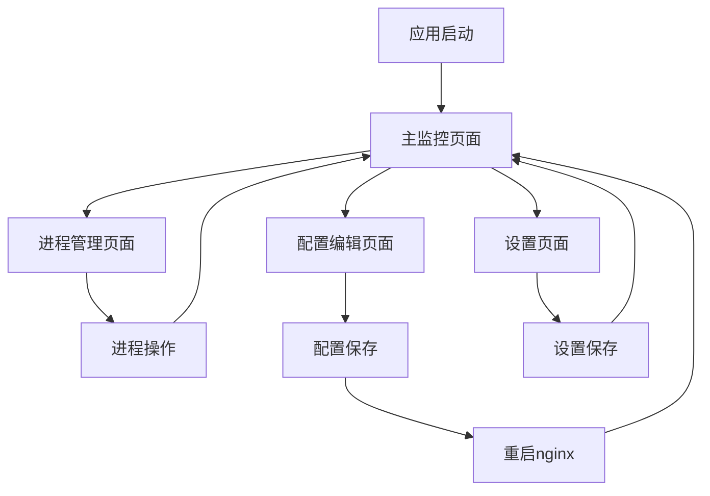

# Nginx Spy - Windows桌面监控管理工具

## 1. Product Overview
Nginx Spy是一个专为Windows平台设计的nginx进程监控和管理工具，提供实时进程状态监控、配置文件可视化编辑和进程生命周期管理功能。
- 解决Windows环境下nginx进程管理复杂、配置文件编辑困难的问题，为系统管理员和开发者提供直观的图形化管理界面。
- 通过集成化的管理平台，提高nginx服务器的运维效率和配置准确性。

## 2. Core Features

### 2.1 User Roles
本应用为单用户桌面应用程序，无需区分用户角色。

### 2.2 Feature Module
我们的nginx监控管理工具包含以下主要页面：
1. **主监控页面**：进程状态展示、实时监控面板、快速操作按钮
2. **进程管理页面**：进程列表管理、启停控制、历史记录查看
3. **配置编辑页面**：配置文件解析展示、可视化编辑器、配置验证
4. **设置页面**：应用程序设置、数据库管理、日志查看

### 2.3 Page Details

| Page Name | Module Name | Feature description |
|-----------|-------------|---------------------|
| 主监控页面 | 进程状态面板 | 显示当前运行的nginx进程数量、CPU和内存使用情况、运行时长统计 |
| 主监控页面 | 快速操作区 | 提供一键启动、停止、重启所有nginx进程的按钮 |
| 主监控页面 | 实时监控图表 | 展示nginx进程的性能指标变化趋势图 |
| 进程管理页面 | 进程列表 | 显示所有nginx进程详细信息（PID、路径、配置文件、启动时间） |
| 进程管理页面 | 单进程操作 | 对单个nginx进程进行启动、停止、重启、删除操作 |
| 进程管理页面 | 历史记录 | 查看nginx进程的启动历史和操作日志 |
| 配置编辑页面 | 配置文件树 | 以树形结构展示nginx配置文件的层级关系 |
| 配置编辑页面 | 可视化编辑器 | 提供表单化的配置编辑界面，支持语法高亮和错误检查 |
| 配置编辑页面 | 配置预览 | 实时预览配置文件内容和语法验证结果 |
| 设置页面 | 应用设置 | 配置监控间隔、自动启动、通知设置等应用参数 |
| 设置页面 | 数据库管理 | 查看和管理LiteDB中存储的nginx实例信息 |
| 设置页面 | 日志查看 | 查看应用程序运行日志和错误信息 |

## 3. Core Process

**主要用户操作流程：**

1. **监控流程**：用户启动应用 → 自动扫描nginx进程 → 显示进程状态 → 实时更新监控数据
2. **管理流程**：选择nginx进程 → 执行启停操作 → 确认操作结果 → 更新进程状态
3. **配置编辑流程**：选择nginx实例 → 加载配置文件 → 可视化编辑 → 验证配置 → 保存并重启nginx
4. **新实例发现流程**：检测到新nginx进程 → 自动记录到数据库 → 更新界面显示 → 提供管理选项

## 4. User Interface Design

### 4.1 Design Style
- **主色调**：深蓝色 (#2C3E50) 作为主色，浅灰色 (#ECF0F1) 作为背景色
- **按钮样式**：现代扁平化设计，圆角矩形按钮，悬停时有阴影效果
- **字体**：微软雅黑 14px 作为主要字体，代码区域使用 Consolas 12px
- **布局风格**：左侧导航栏 + 主内容区域的经典布局，支持响应式调整
- **图标风格**：使用Material Design风格的矢量图标，统一视觉体验

### 4.2 Page Design Overview

| Page Name | Module Name | UI Elements |
|-----------|-------------|-------------|
| 主监控页面 | 进程状态面板 | 卡片式布局，绿色/红色状态指示器，数字统计显示，进度条展示资源使用率 |
| 主监控页面 | 快速操作区 | 大号彩色按钮组，启动(绿色)、停止(红色)、重启(橙色)，带确认对话框 |
| 主监控页面 | 实时监控图表 | Chart.js折线图，实时数据更新，可切换时间范围，支持缩放 |
| 进程管理页面 | 进程列表 | DataGrid表格，支持排序筛选，状态列带颜色标识，操作列带图标按钮 |
| 配置编辑页面 | 配置文件树 | TreeView控件，文件夹图标，可展开折叠，支持搜索 |
| 配置编辑页面 | 可视化编辑器 | 分栏布局，左侧表单编辑，右侧代码预览，语法高亮显示 |
| 设置页面 | 应用设置 | 选项卡布局，分组设置项，开关控件，数值输入框 |

### 4.3 Responsiveness
桌面优先设计，支持最小1024x768分辨率，主要针对Windows桌面环境优化，不考虑触摸交互。