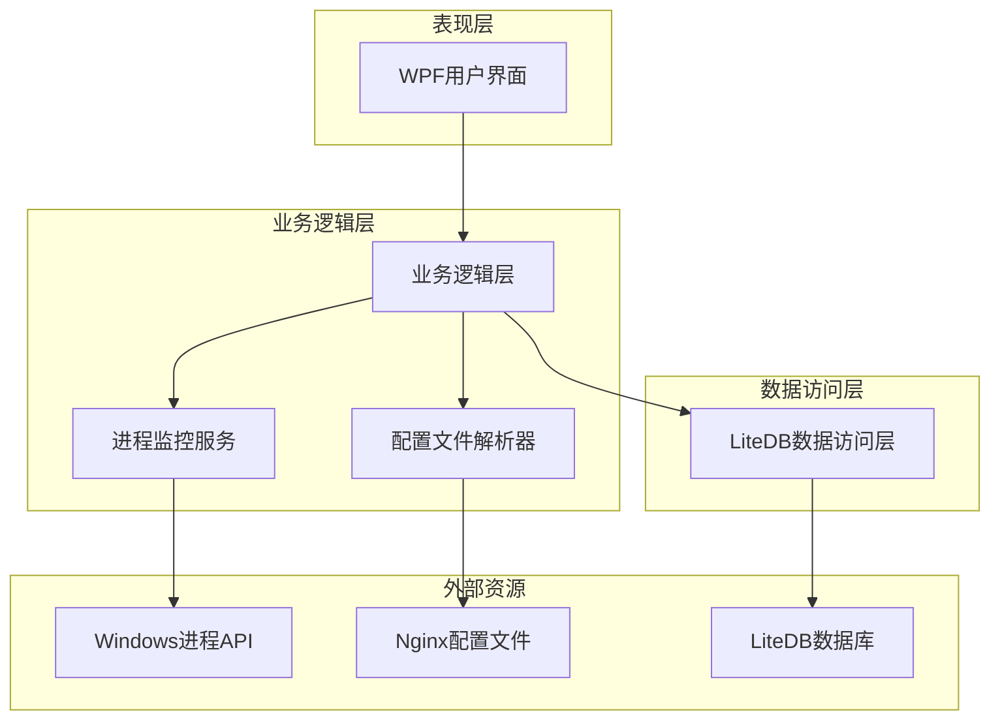
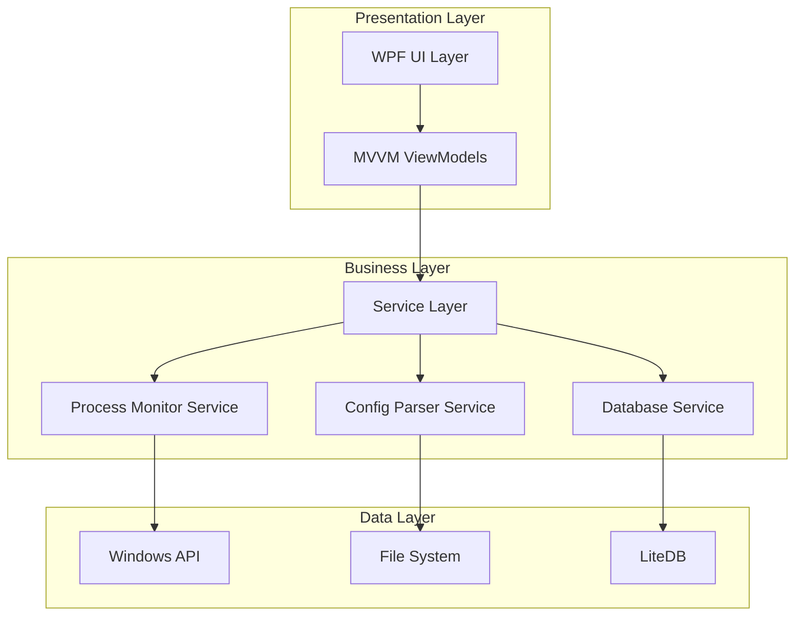
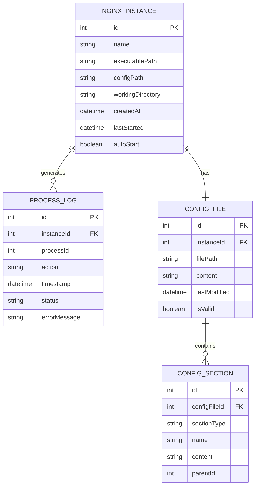

# Nginx Spy - 技术架构设计文档

## 1. Architecture design



## 2. Technology Description

* Frontend: WPF (.NET 8) + MaterialDesignInXamlToolkit + LiveCharts2

* Backend: .NET 8 Class Libraries

* Database: LiteDB 5.x

* Process Management: System.Diagnostics + WMI

* Configuration Parser: Custom Nginx Config Parser

## 3. Route definitions

| Route                 | Purpose               |
| --------------------- | --------------------- |
| MainWindow            | 主窗口，包含导航和主要内容区域       |
| MonitorView           | 监控页面，显示nginx进程状态和实时数据 |
| ProcessManagementView | 进程管理页面，列表展示和操作nginx进程 |
| ConfigEditorView      | 配置编辑页面，解析和编辑nginx配置文件 |
| SettingsView          | 设置页面，应用程序配置和数据库管理     |

## 4. API definitions

### 4.1 Core API

进程监控相关

```
INginxProcessService.GetRunningProcesses()
```

Request: 无参数

Response:

| Param Name | Param Type         | Description    |
| ---------- | ------------------ | -------------- |
| processes  | List<NginxProcess> | 当前运行的nginx进程列表 |

Example

```json
[
  {
    "id": 1234,
    "processId": 5678,
    "executablePath": "C:\\nginx\\nginx.exe",
    "configPath": "C:\\nginx\\conf\\nginx.conf",
    "startTime": "2024-01-15T10:30:00Z",
    "status": "Running"
  }
]
```

进程控制相关

```
INginxProcessService.StartProcess(string executablePath, string configPath)
INginxProcessService.StopProcess(int processId)
INginxProcessService.RestartProcess(int processId)
```

配置文件解析相关

```
INginxConfigService.ParseConfig(string configPath)
INginxConfigService.SaveConfig(NginxConfig config, string configPath)
INginxConfigService.ValidateConfig(NginxConfig config)
```

数据库操作相关

```
INginxRepository.GetAllInstances()
INginxRepository.SaveInstance(NginxInstance instance)
INginxRepository.DeleteInstance(int id)
```

## 5. Server architecture diagram



## 6. Data model

### 6.1 Data model definition



### 6.2 Data Definition Language

Nginx实例表 (nginx\_instances)

```sql
-- 创建nginx实例表
CREATE TABLE nginx_instances (
    id INTEGER PRIMARY KEY AUTOINCREMENT,
    name VARCHAR(100) NOT NULL,
    executable_path VARCHAR(500) NOT NULL,
    config_path VARCHAR(500) NOT NULL,
    working_directory VARCHAR(500),
    created_at DATETIME DEFAULT CURRENT_TIMESTAMP,
    last_started DATETIME,
    auto_start BOOLEAN DEFAULT FALSE
);

-- 创建进程日志表
CREATE TABLE process_logs (
    id INTEGER PRIMARY KEY AUTOINCREMENT,
    instance_id INTEGER NOT NULL,
    process_id INTEGER,
    action VARCHAR(50) NOT NULL,
    timestamp DATETIME DEFAULT CURRENT_TIMESTAMP,
    status VARCHAR(20) NOT NULL,
    error_message TEXT,
    FOREIGN KEY (instance_id) REFERENCES nginx_instances(id)
);

-- 创建配置文件表
CREATE TABLE config_files (
    id INTEGER PRIMARY KEY AUTOINCREMENT,
    instance_id INTEGER NOT NULL,
    file_path VARCHAR(500) NOT NULL,
    content TEXT,
    last_modified DATETIME,
    is_valid BOOLEAN DEFAULT TRUE,
    FOREIGN KEY (instance_id) REFERENCES nginx_instances(id)
);

-- 创建配置段表
CREATE TABLE config_sections (
    id INTEGER PRIMARY KEY AUTOINCREMENT,
    config_file_id INTEGER NOT NULL,
    section_type VARCHAR(50) NOT NULL,
    name VARCHAR(100),
    content TEXT,
    parent_id INTEGER,
    FOREIGN KEY (config_file_id) REFERENCES config_files(id),
    FOREIGN KEY (parent_id) REFERENCES config_sections(id)
);

-- 创建索引
CREATE INDEX idx_process_logs_instance_id ON process_logs(instance_id);
CREATE INDEX idx_process_logs_timestamp ON process_logs(timestamp DESC);
CREATE INDEX idx_config_files_instance_id ON config_files(instance_id);
CREATE INDEX idx_config_sections_config_file_id ON config_sections(config_file_id);
CREATE INDEX idx_config_sections_parent_id ON config_sections(parent_id);

-- 初始化数据
INSERT INTO nginx_instances (name, executable_path, config_path, working_directory, auto_start)
VALUES 
('Default Nginx', 'C:\\nginx\\nginx.exe', 'C:\\nginx\\conf\\nginx.conf', 'C:\\nginx', TRUE),
('Development Server', 'C:\\dev\\nginx\\nginx.exe', 'C:\\dev\\nginx\\conf\\nginx.conf', 'C:\\dev\\nginx', FALSE);
```

